# Lab 2 - Covid19

## First we download the last csv from this site : https://www.data.gouv.fr/fr/datasets/donnees-hospitalieres-relatives-a-lepidemie-de-covid-19/
### Data :
### - dep : department (there is 3 lines by department)
### - sexe : 0 = everybody, 1 = male, 2 = female
### - jour : day when data were taken
### - hosp : number of people currently hospitalized
### - rea : number of people currently in resuscitation or critical care
### - rad : total amount of patient that returned home
### - dc : total amout of deaths at the hospital

## We have to import some libaries to our project
```CMD
pip install -U scikit-learn
```
```Python
import pandas as pd
import numpy as np
import matplotlib.pyplot as plt
from scipy import stats
from datetime import date
```

## Now we have to import our data into Jupyter
```CMD
jupyter-lab
```
```Python
df = pd.read_csv("D:\efrei\cours\s7\machine learning\lab2\donnees-hospitalieres-covid19-2020-11-17-19h00.csv", delimiter = ';')
```

## We can answer the questions now
### Which day France has registered the highest number of Covid patients in hospitals?
```Python
df_day = df[df.sexe == 0].groupby(df['jour']).sum()
df_day[df_day.hosp == df_day.hosp.max()]
```
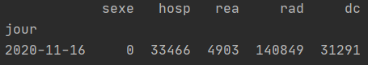

### When has France registered the highest number of Covid patients in intensive care (réanimation) ?
```Python
df_day[df_day.rea == df_day.rea.max()]
```


### Which day has France registered the highest number of deaths in hospitals? 
```Python
df_day = df[df['sexe'] == 0].groupby(['jour']).sum()
df_day['death'] = df_day.dc.diff()
df_day[df_day.death == df_day.death.max()]
```
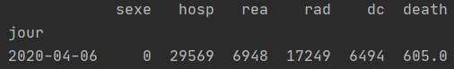

### Plot the daily evolution of Covid patients in hospitals
```Python
df_day.hosp.plot()
```
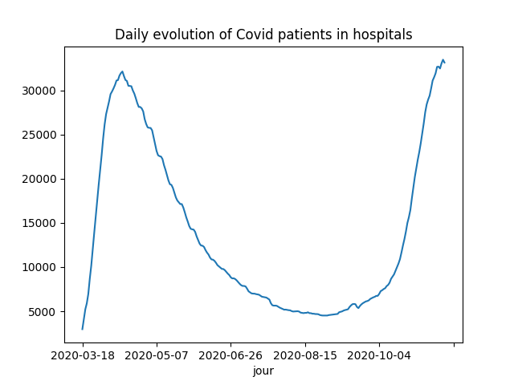

### Plot the daily evolution of Covid patients in intensive care
```Python
df_day.rea.plot()
```
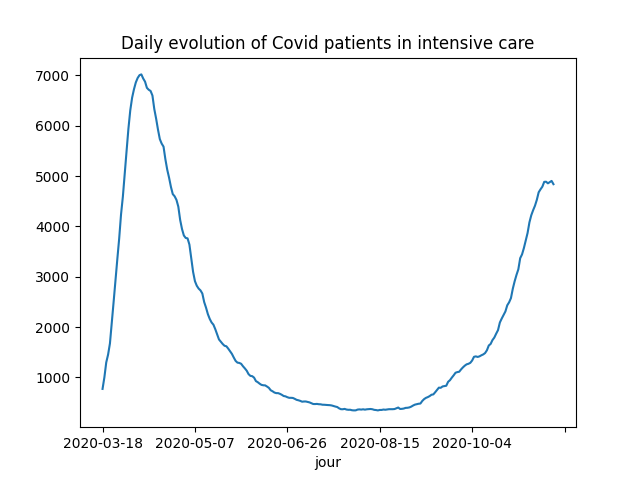

### Plot the evolution of the daily deaths due to Covid in hospitals
```Python
df_day.death.plot()
```
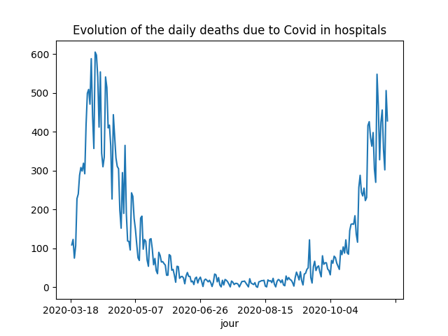

### Plot the cumulative number of deaths in hospitals
```Python
df_day.dc.plot()
```
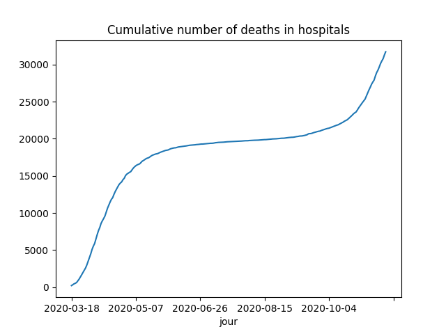

### Compare the evolution of using intensive cares between Paris and 92th department
```Python
df_dep92 = df[df['dep'] == '92']
df_dep92 = df_dep92[df_dep92['sexe'] == 0].groupby(df_dep92.jour).sum()
df_dep75 = df[df['dep'] == '75']
df_dep75 = df_dep75[df_dep75['sexe'] == 0].groupby(df_dep75.jour).sum()


df_dep75.rea.plot()
df_dep92.rea.plot()
plt.legend(['Paris', 'Hauts-de-Seine'])
plt.title('Covid Data Analysis 92 and 75')
plt.show()
```
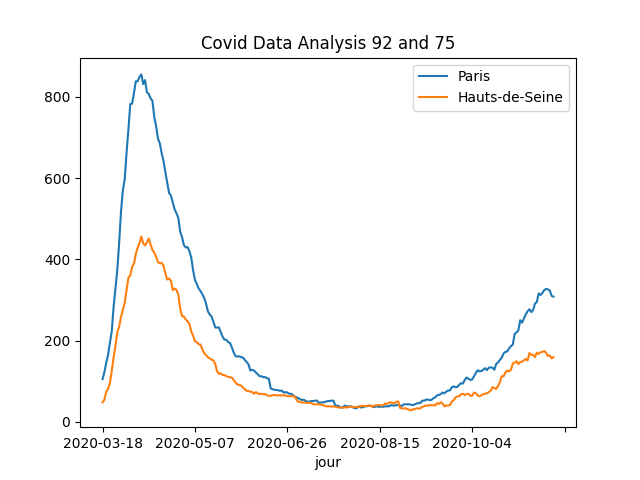

### Plot on the same curve the daily number of patients in intensive care by sex (Female, Male, All) 
```Python
df_reaA = df[df['sexe'] == 0].groupby(df['jour']).sum()
df_reaH = df[df['sexe'] == 1].groupby(df['jour']).sum()
df_reaF = df[df['sexe'] == 2].groupby(df['jour']).sum()

df_reaA.rea.plot()
df_reaH.rea.plot()
df_reaF.rea.plot()
plt.legend(['All', 'Male', 'Female'])
plt.title('Rea by Gender')
plt.show()
```
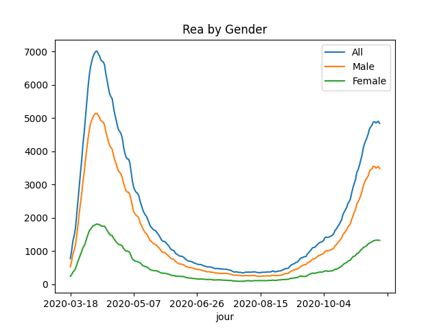

### Display the number of patients in hospitals yesterday distinguished by sex (Male, Female, All), use BAR plots and PIE
```Python
df_last = df[df.jour == df.jour.max()].groupby(df.sexe).sum()
df_last[['hosp']].plot(kind = 'bar', xlabel={'All', 'Males', 'Females'}, color=('red', 'blue', 'green'))

df_last.hosp.plot(kind = 'pie', labels = {'All', 'Males', 'Females'})
```
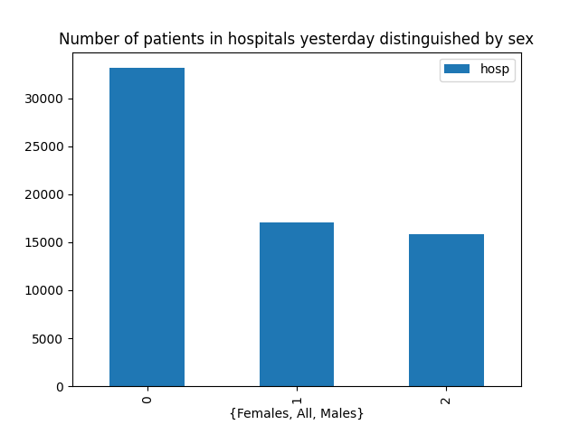
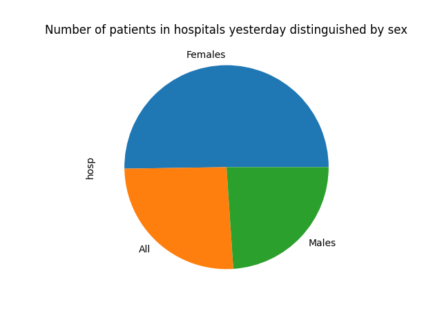


## There are more

```Python
df_day['day'] = df_day.index
x = date.fromisoformat('2020-03-18')
first_day = date.toordinal(x)
```
```Python
def date_to_ordinal(x):
    y = date.fromisoformat(x)
    return date.toordinal(y) - first_day
```
```Python
df_day['counter'] = df_day.day.map(date_to_ordinal)
```
```Python
slope, intercept, rvalue, pvalue, stderr = stats.linregress(df_day.counter.to_numpy(), df_day.dc.to_numpy())
df_day.dc.plot()
df_day.counter.map(lambda e: intercept + slope * e).plot()
plt.legend(['Real', 'Simulation'])
plt.show()
```
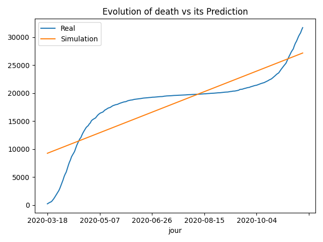

## We can also do it like this
```Python
p3 = np.poly1d(np.polyfit(df_day.counter.to_numpy(), df_day.dc.to_numpy(), deg = 5))

df_day.dc.plot()
df_day.counter.map(lambda e: p3(e)).plot()
plt.legend(['Real', 'Simulation'])
plt.title('Evolution of death vs its Prediction')
plt.show()
```
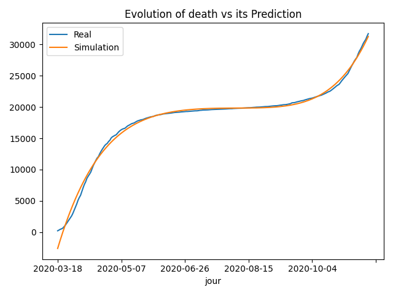

## And even do some previsions
```Python
plt.plot(df_day.counter.to_numpy(), df_day.dc.to_numpy())
plt.plot(df_day.counter.to_numpy(), df_day.counter.map(lambda e:p3(e)))
d=np.arange(df_day.counter[-1] + 1, 300, 1)
plt.plot(d, p3(d))
plt.show()
```
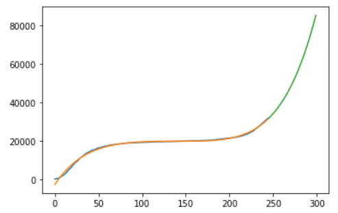
